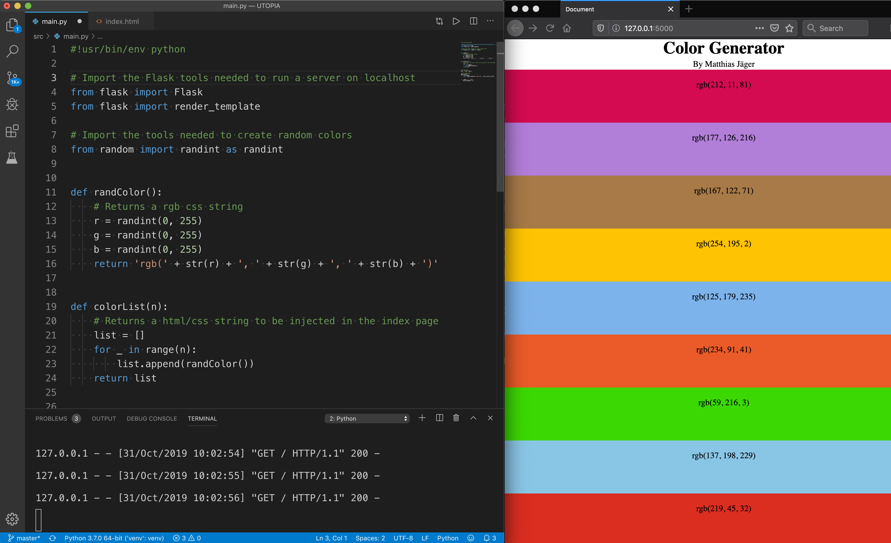
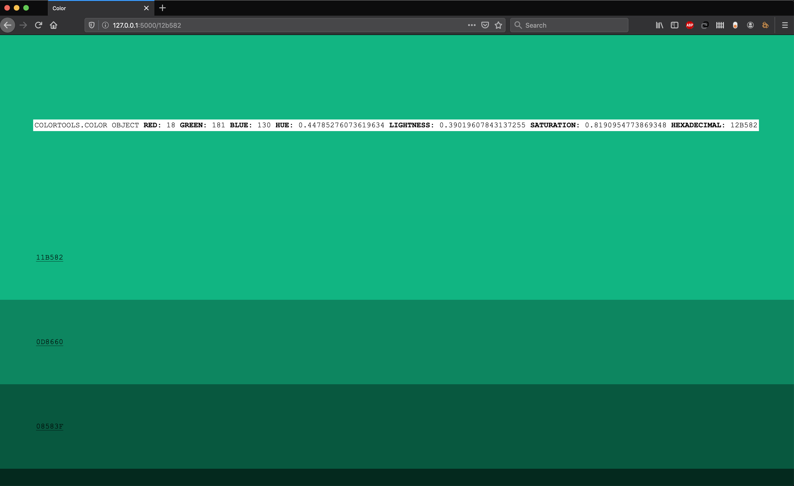

# UTOPIA


# An exprimental website to explore colors

This is my second attempt of creating a "browsable color picker" for the web. To make it harder for me I am using the Python programming language (in which I'm a total noob).

# First prototype


This is my first output on the main route ("/") loading my template with the Flask framework and rendering 100 ``<div>`` tags with random colors. The program code is structured in the folder ``src`` and split in two python files (``server.py``, ``colortools.py``) with the main logic. As assetes I wrote a simple CSS file (``style.css``) and added two HTML templates containing Flask code (``index.html``, ``colors.html``).

### Install the dependencies
```$ pip install Flask```

### Set up the server and run it
```$ export FLASK_APP=server.py```
```$ flask run```


### Server code
```python
#!usr/bin/env python

# Using the Flask framework to handle the server
from flask import Flask, render_template

# Custom Functionality to handle colors imported
from colortools import randomHexColorList

# Default folders 'static' & 'templates' exist
app = Flask(__name__)

# Return the index page html template and inject a list with 100 colors
@app.route('/')
def index():
    return render_template('index.html',
                           result=randomHexColorList(100))

# Runs the server in debug mode on http://127.0.0.1:5000/
if __name__ == '__main__':
    app.run(debug=True)
```

### Template code
```html
<!DOCTYPE html>
<html lang="en">

<head>
  <meta charset="UTF-8">
  <meta name="viewport" content="width=device-width, initial-scale=1.0">
  <meta http-equiv="X-UA-Compatible" content="ie=edge">
  <title>Surf colors for a while</title>
  <link rel="stylesheet" href="{{ url_for('static', filename='style.css') }}">
</head>

<body>
  
  <a class="color-suggestion" style="background-color: #{{ value }}" href="{{ value }}">{{ value }}</a>
  
</body>

</html>
```

### Extending the server code
My next step is to create a restful api with each color as a route & clickable link to a single page with value and brightness tables of the same given color.

```python
# All other routes, no error checking!
@app.route('/<url>')
def single(url):
    # Retrieve the url parameter and turn it into a color object
    base = colorFromUrl(url)
    # Hand over the data to the template
    return render_template('color.html',
                           color=base,
                           lightness=lightnessHexColorList(base),
                           hue=hueHexColorList(base),
                           saturation=saturationHexColorList(base),
                           footer=hueHexColorList(base))
```

# Color code


#### Done so far
- [x] Flask is running
- [x] Development server working
- [x] Server code is working - no errorchecks
- [x] Added basic color functionalities
- [x] Tested basic logic
- [x] Seperate server and color code
- [x] Solve Flask middleware
- [x] Simplify templates and markup
- [x] Simplify server code and variables

#### To do
- [ ] Calculate better color lists
- [ ] Make different sections
- [ ] Add CSS effects like gradients
- [ ] Start working on the actual ux (postponed)


### Viewing the rendered page in the browser

